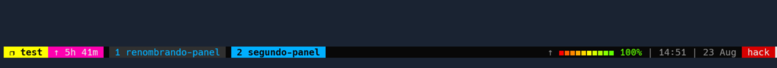

Acompañe a aprender a **gestionar** una herramienta muy potente, **tmux** es un multiplexador de terminales que permite lanzar múltiples terminales.

Esta información es una recopilación de  <https://www.youtube.com/watch?v=1dDahc214co>

Personaliza tmux con el tema !Oh my tmux! <https://github.com/gpakosz/.tmux>

# [](#header-1)Gestión de la herramienta tmux

    tmux new-session -s "Nueva sesión" => creación de una nueva sesión


    [ctrl + b] + , => renombrar el panel actual  


    [ctrl + b] + 2 => navegando al segundo panel



    [ctrl + b] + $ => renombrando panel


    [ctrl + b] + $ => renombrando panel


    [ctrl + b] + " => split horizontal del panel actual


    [ctrl + b] + % => split vertical del panel actual


    [ctrl + b] + x => cerrar el panel actual

    [ctrl + b] + & => cerrar la session

    [ctrl + b] + space => mover las ventanas en la dirección de las agujas del reloj


    [ctrl + b] + } => alternar paneles


    [ctrl + b] + & => cerrar la session

    [ctrl + b] + & => cerrar la session

    [ctrl + b] + & => cerrar la session

    [ctrl + b] + & => cerrar la session

    [ctrl + b] + & => cerrar la session

    [ctrl + b] + & => cerrar la session

    [ctrl + b] + & => cerrar la session

    [ctrl + b] + & => cerrar la session

    [ctrl + b] + & => cerrar la session


## [](#header-2)Header 2

> This is a blockquote following a header.
>
> When something is important enough, you do it even if the odds are not in your favor.

### [](#header-3)Header 3

```js
// Javascript code with syntax highlighting.
var fun = function lang(l) {
  dateformat.i18n = require('./lang/' + l)
  return true;
}
```

```ruby
# Ruby code with syntax highlighting
GitHubPages::Dependencies.gems.each do |gem, version|
  s.add_dependency(gem, "= #{version}")
end
```

#### [](#header-4)Header 4

*   This is an unordered list following a header.
*   This is an unordered list following a header.
*   This is an unordered list following a header.

##### [](#header-5)Header 5

1.  This is an ordered list following a header.
2.  This is an ordered list following a header.
3.  This is an ordered list following a header.

###### [](#header-6)Header 6

| head1        | head two          | three |
|:-------------|:------------------|:------|
| ok           | good swedish fish | nice  |
| out of stock | good and plenty   | nice  |
| ok           | good `oreos`      | hmm   |
| ok           | good `zoute` drop | yumm  |

### There's a horizontal rule below this.

* * *

### Here is an unordered list:

*   Item foo
*   Item bar
*   Item baz
*   Item zip

### And an ordered list:

1.  Item one
1.  Item two
1.  Item three
1.  Item four

### And a nested list:

- level 1 item
  - level 2 item
  - level 2 item
    - level 3 item
    - level 3 item
- level 1 item
  - level 2 item
  - level 2 item
  - level 2 item
- level 1 item
  - level 2 item
  - level 2 item
- level 1 item

### Small image


### Large image


### Definition lists can be used with HTML syntax.

<dl>
<dt>Name</dt>
<dd>Godzilla</dd>
<dt>Born</dt>
<dd>1952</dd>
<dt>Birthplace</dt>
<dd>Japan</dd>
<dt>Color</dt>
<dd>Green</dd>
</dl>

```
Long, single-line code blocks should not wrap. They should horizontally scroll if they are too long. This line should be long enough to demonstrate this.
```

```
The final element.
```
