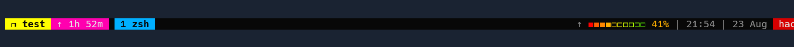
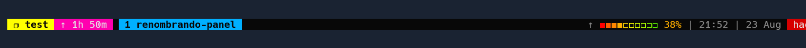
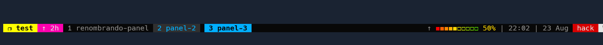
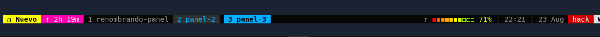

Acompañe a aprender a **gestionar** una herramienta muy potente, **tmux** es un multiplexador de terminales que permite lanzar múltiples terminales.

Esta información es una recopilación de  <https://www.youtube.com/watch?v=1dDahc214co>

Personaliza tmux con el tema !Oh my tmux! <https://github.com/gpakosz/.tmux>

# Gestión de la herramienta tmux

    tmux new-session -s "Nueva sesión" => creación de una nueva sesión

    [ctrl + b] + , => renombrar el panel actual  

    [ctrl + b] + c => crear un panel nuevo

    [ctrl + b] + 3 => navegando al tercer panel

    [ctrl + b] + $ => renombrando sesión

    [ctrl + b] + " => split horizontal del panel actual

    [ctrl + b] + % => split vertical del panel actual

    [ctrl + b] + x => cerrar el panel actual

    [ctrl + b] + & => cerrar la session

    [ctrl + b] + space => mover los paneles en la dirección de las agujas del reloj

    [ctrl + b] + } => alternar paneles

    [ctrl + b] + m => activar el uso del mouse

    [ctrl + b] + [up, down, left, right] => redimensionar el panel actual con el uso de las flechas

    [ctrl + b] + [shift + 1] => mover el panel actual a uno nuevo

    [ctrl + b] + (shift + [ ) => activar el modo copia

    [ctrl + space] => una vez ingresado en el modo copia, activas el modo selección

    [ctrl + s] => una vez ingresado en el modo copia, activas el modo busqueda

    [ctrl + w] => copias lo que has seleccionado ( presiona q para salir del modo copia)

     tmux list-session => mostrar las sesiones activas

    tmux attach -t "test" => ingresar a la sesión especificada

    [ctrl + b] + s => previsualización de las sesiones activas (q para salir de esta previsualización)

    [ctrl + b] + w => previsualización de las sesiones con su jerarquía

    [ctrl + b] + q => visualización de los números identificativos de cada panele

    [ctrl + b] + t => mostrar la hora en el panel actual

    [ctrl + b] + (:join -s 1 -t 2) => unir el panel uno con el segundo panel

    [ctrl + b] + (:swap-window -s 2 -t 1) => alternar el segundo panel a la primera posición

