Acompañe a aprender a **gestionar** una herramienta muy potente, **tmux** es un multiplexador de terminales que permite lanzar múltiples terminales.

Esta información es una recopilación de  <https://www.youtube.com/watch?v=1dDahc214co>

Personaliza tmux con el tema !Oh my tmux! <https://github.com/gpakosz/.tmux>

Manual de tmux <https://man.openbsd.org/OpenBSD-current/man1/tmux.1>

# Gestión de la herramienta tmux

    tmux new-session -s "Nueva sesión" => creación de una nueva sesión

    [ctrl + b] + , => renombrar el panel actual  

    [ctrl + b] + c => crear un panel nuevo

    [ctrl + b] + 3 => navegando al tercer panel

    [ctrl + b] + $ => renombrando sesión

    [ctrl + b] + " => split horizontal del panel actual

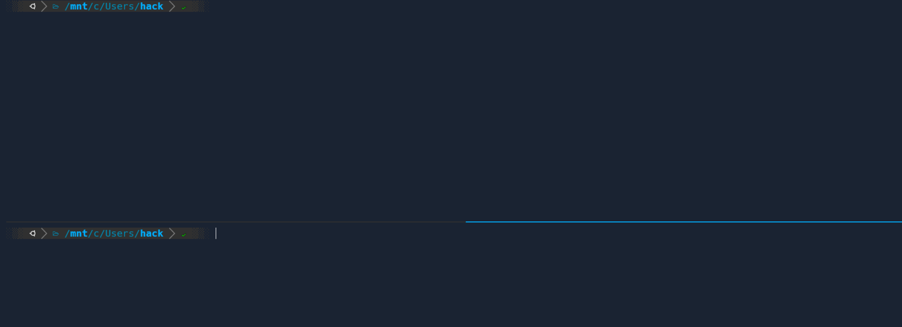

    [ctrl + b] + % => split vertical del panel actual

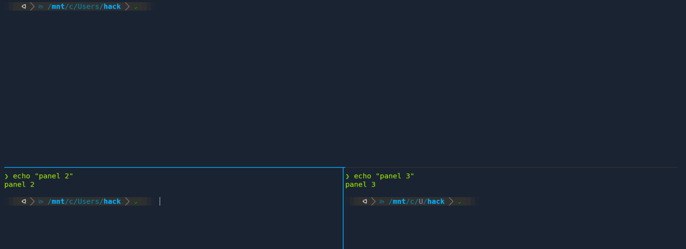

    [ctrl + b] + x => cerrar el panel actual

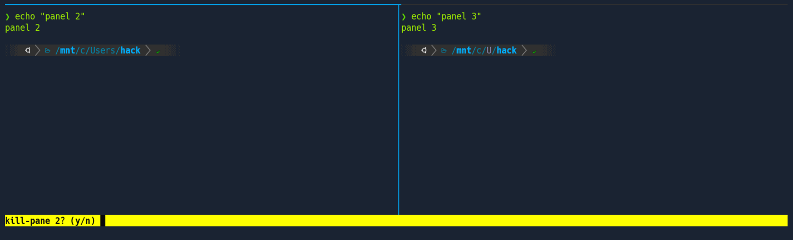

    [ctrl + b] + & => cerrar la session

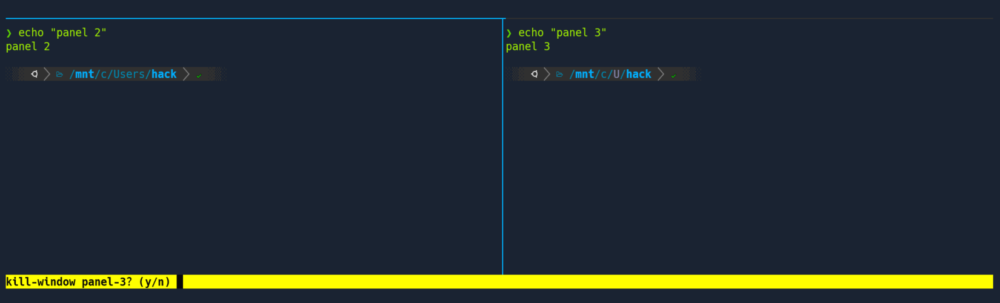

    [ctrl + b] + space => mover los paneles en la dirección de las agujas del reloj

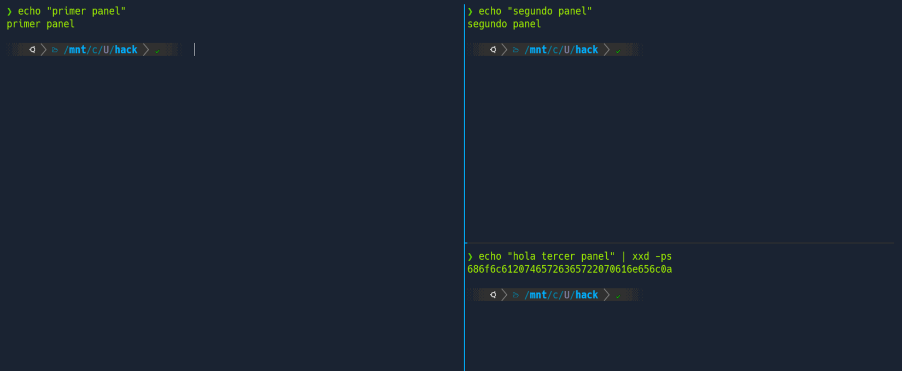

    [ctrl + b] + } => alternar paneles

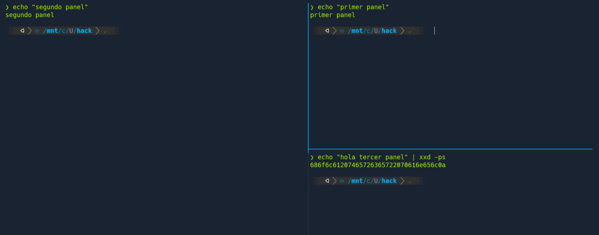

    [ctrl + b] + m => activar el uso del mouse

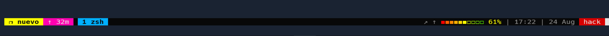

    [ctrl + b] + [up, down, left, right] => redimensionar el panel actual con el uso de las flechas

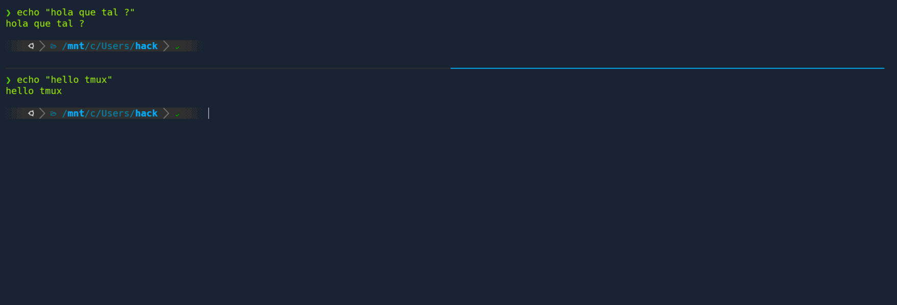

    [ctrl + b] + [shift + 1] => mover el panel actual a uno nuevo

    [ctrl + b] + (shift + [ ) => activar el modo copia

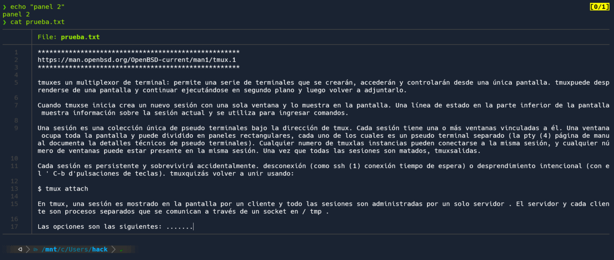

    [ctrl + space] => una vez ingresado en el modo copia, activas el modo selección

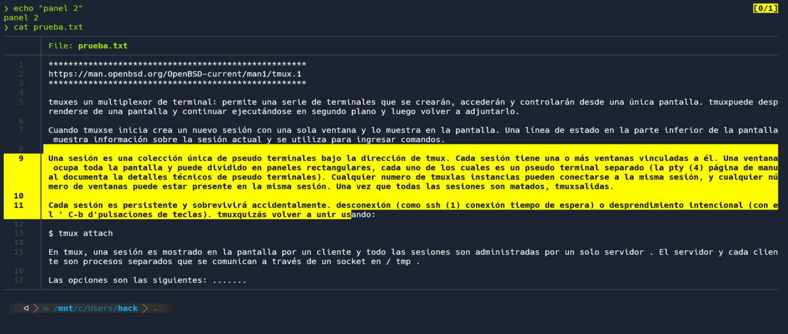

    [ctrl + s] => una vez ingresado en el modo copia, activas el modo busqueda

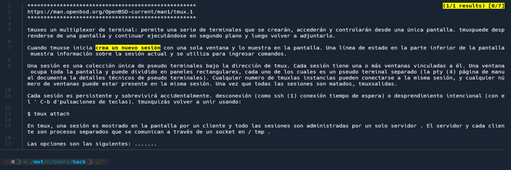

    [ctrl + w] => copias lo que has seleccionado ( presiona q para salir del modo copia)

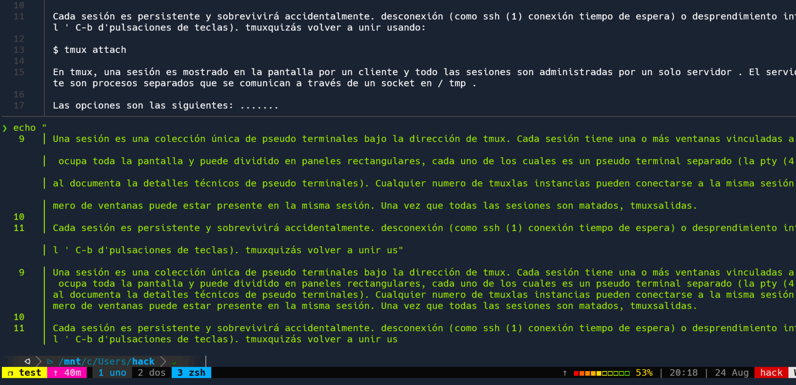

     tmux list-session => mostrar las sesiones activas

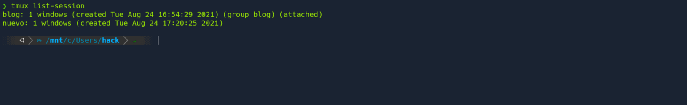

    tmux attach -t "test" => ingresar a la sesión especificada

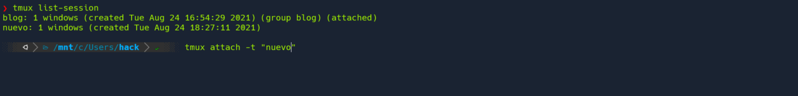

    [ctrl + b] + s => previsualización de las sesiones activas (q para salir de esta previsualización)

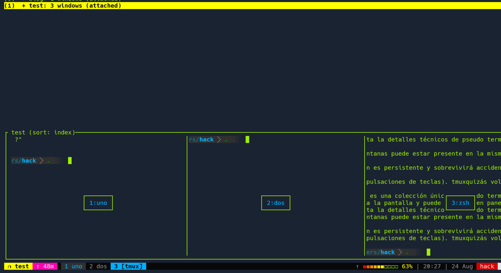

    [ctrl + b] + w => previsualización de las sesiones con su jerarquía

    [ctrl + b] + q => visualización de los números identificativos de cada panele

    [ctrl + b] + t => mostrar la hora en el panel actual

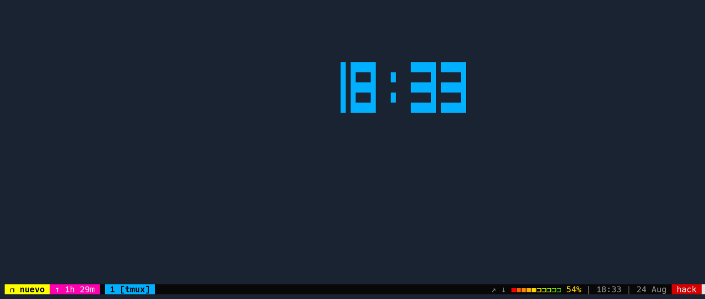

    [ctrl + b] + (:join -s 1 -t 2) => unir el panel uno con el segundo panel

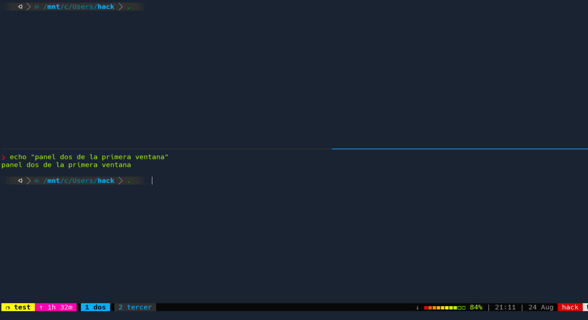

    [ctrl + b] + (:swap-window -s 2 -t 1) => alternar el segundo panel a la primera posición

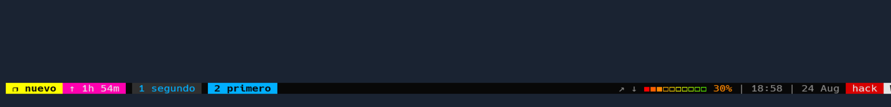

